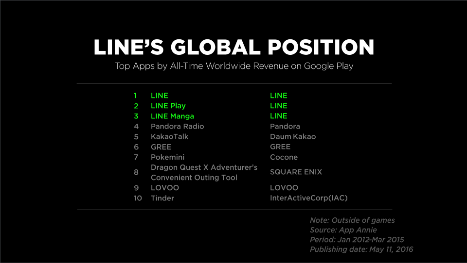

# Bot line
[](https://travis-ci.org/ec2ainun/bot-line-indonesian-summarizer)
## Kenapa platform LINE?

- Memiliki global monthly active users sebanyak 220.000.000 user per juli 2016
- Telah tersebar di 230 negara
- dan Support 19 bahasa




- Dan di indonesia sendiri 1/3 penduduknya telah menggunakan LINE


## Kenapa Meringkas teks?

- Menurut Penelitian yang dilakukan organisasi Mindjet, manusia kewalahan dengan banyaknya informasi yang diproses, dan membuang 1/3 waktu yang ada untuk memproses dan mencerna informasi yang tidak relevan


## Setup environment

- Tutorial Setup bahasa indonesia Dapat mengunjungi [link ini](https://www.dicoding.com/academies/32/tutorials/719)
- Offical Documentation python SDK dapat mengunjungi [link ini](https://github.com/line/line-bot-sdk-python)
- Kunjungi [Link ini](https://business.line.me/id/) untuk mendapatkan CHANNEL_SECRET dan CHANNEL_ACCESS_TOKEN

## Kenapa menggunakan python?
- Karena penulis beranggapan bahwa python merupakan bahasa yang umum digunakan oleh Data Scientist
- Dan Jupyter Notebook support penuh kernel bahasa python, sehingga memungkinkan penulis untuk mengimplementasikan, membuat, dan mengintegrasikan algoritma yang diasumsikan oleh penulis

## Testing Bot?
1. Install LINE apps dari Google Play atau App Store.
2. Klik tombol dibawah

  <a href="https://line.me/R/ti/p/%40ony5028v"></a>

3. atau Scan QR Code dibawah
  

## Next To Do?
- [ ] Mengimplemantasikan Algoritma Evolusi dalam meringkas teks, berdasarkan paper [TF-IDF-ENHANCED GENETIC ALGORITHM UNTUK EXTRACTIVE AUTOMATIC TEXT SUMMARIZATION](http://jtiik.ub.ac.id/index.php/jtiik/article/download/217/pdf)

## LICENSE
[MIT](/LICENSE)

```
MIT License

Copyright (c) 2017 Moch. Ainun Najib

Permission is hereby granted, free of charge, to any person obtaining a copy
of this software and associated documentation files (the "Software"), to deal
in the Software without restriction, including without limitation the rights
to use, copy, modify, merge, publish, distribute, sublicense, and/or sell
copies of the Software, and to permit persons to whom the Software is
furnished to do so, subject to the following conditions:

The above copyright notice and this permission notice shall be included in all
copies or substantial portions of the Software.

THE SOFTWARE IS PROVIDED "AS IS", WITHOUT WARRANTY OF ANY KIND, EXPRESS OR
IMPLIED, INCLUDING BUT NOT LIMITED TO THE WARRANTIES OF MERCHANTABILITY,
FITNESS FOR A PARTICULAR PURPOSE AND NONINFRINGEMENT. IN NO EVENT SHALL THE
AUTHORS OR COPYRIGHT HOLDERS BE LIABLE FOR ANY CLAIM, DAMAGES OR OTHER
LIABILITY, WHETHER IN AN ACTION OF CONTRACT, TORT OR OTHERWISE, ARISING FROM,
OUT OF OR IN CONNECTION WITH THE SOFTWARE OR THE USE OR OTHER DEALINGS IN THE
SOFTWARE.
```
